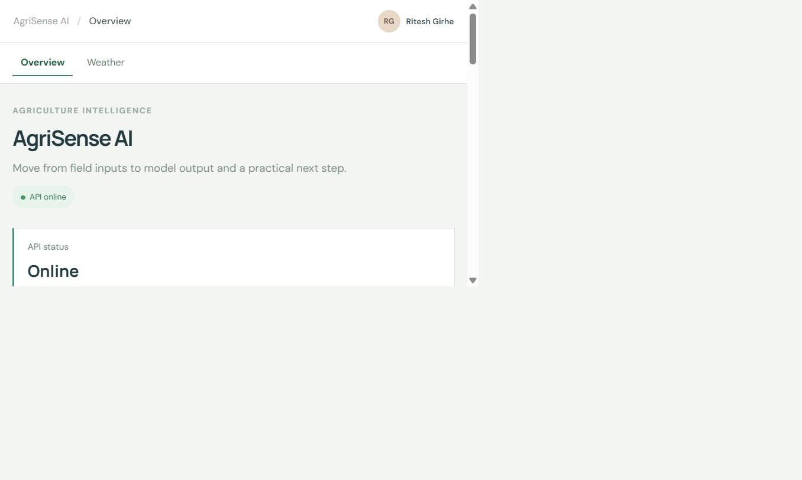
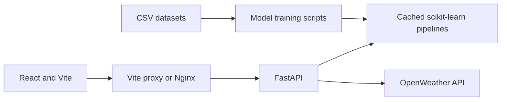

# AgriSense AI

AgriSense AI is a small agriculture decision-support app that turns field and market inputs into crop, fertilizer, irrigation, price, and yield model outputs. A FastAPI service hosts the trained scikit-learn pipelines; a responsive React workspace presents predictions and optional live weather.

## Preview



## Problem and approach

Farm decisions depend on many interacting signals, while useful data is often split between soil measurements, weather, crop plans, and market records. AgriSense AI brings five focused prediction workflows into one place and makes the path visible: **inputs → model prediction → result → practical next step**. Outputs are decision support, not guaranteed outcomes or substitutes for local expertise.

## Features

- Five model-backed prediction workflows with validated inputs and actionable result panels.
- Live current conditions and five-day forecast through the backend weather integration.
- Health endpoint reports model artifact availability; no fabricated farm statistics or confidence percentages.
- Cached model loading, clear JSON errors, OpenAPI docs, Docker Compose, and API tests.

## Architecture



## Machine-learning models

All metrics below are from each trainer's deterministic 80/20 holdout split (`random_state=42`). Classification precision, recall, and F1 are macro averages.

| Classification model | Accuracy | Precision | Recall | F1-score |
| --- | ---: | ---: | ---: | ---: |
| Crop recommendation | 99.55% | 99.57% | 99.55% | 99.55% |
| Fertilizer recommendation | 87.35% | 70.77% | 72.56% | 71.27% |
| Irrigation prediction | 97.05% | 97.76% | 79.74% | 84.76% |

| Regression model | MAE | RMSE | R² |
| --- | ---: | ---: | ---: |
| Price prediction | ₹48.30 | ₹137.25 | 0.9993 |
| Yield prediction | 1.1202 t/ha | 2.9305 t/ha | 0.9857 |

These are dataset holdout scores, not production guarantees. The price model uses a random split rather than a time-forward evaluation, so its scores should not be interpreted as future-market performance.

## Stack

Python 3.12, FastAPI, Pydantic, pandas, scikit-learn, Joblib, React 18, Vite, Nginx, and Docker Compose.

## Run locally

Requirements: Python 3.12, Node.js/npm, and an OpenWeather API key for live weather.

```powershell
py -3.12 -m venv .venv
.\.venv\Scripts\Activate.ps1
python -m pip install -r backend\requirements.txt
Copy-Item .env.example .env
```

Set `OPENWEATHER_API_KEY` in `.env` to enable weather. Without it, model predictions still work and the weather panel reports that the integration is unavailable.

In one terminal, start the API from the repository root:

```powershell
uvicorn backend.app.main:app --reload
```

In another terminal, start the frontend:

```powershell
npm --prefix frontend install
npm --prefix frontend run dev
```

Open <http://localhost:5173>. Interactive API documentation is at <http://localhost:8000/docs>.

## Environment variables

| Variable | Required | Default | Purpose |
| --- | --- | --- | --- |
| `OPENWEATHER_API_KEY` | No | Empty | Enables live weather requests through the backend. |
| `WEATHER_CITY` | No | `Delhi` | Default location used when a weather request has no location. |

Set these in the root `.env` file for local or Compose runs. The example file contains no credentials; model prediction endpoints work without weather configuration.

## Docker

From the repository root, run `docker compose up --build`. The UI is served at <http://localhost:5173>, the API at <http://localhost:8000>, and API docs at <http://localhost:8000/docs>. A root `.env` file is optional; set `OPENWEATHER_API_KEY` there to enable weather.

## API and tests

| Method | Endpoint | Purpose |
| --- | --- | --- |
| GET | `/health` | API status and available model artifacts |
| POST | `/api/crop/recommend` | Crop classification |
| POST | `/api/fertilizer/predict` | Fertilizer classification |
| POST | `/api/irrigation/predict` | Irrigation classification |
| POST | `/api/price/predict` | Modal price regression |
| POST | `/api/yield/predict` | Yield regression |
| GET | `/api/weather` | Current conditions and forecast |

Run the test suite from the repository root with `pytest`.

## Retrain

Each script evaluates a held-out split, prints the metrics above, and saves its model artifact under `backend/app/models/`:

```powershell
python ml\crop_recommendation\train.py
python ml\fertilizer\train.py
python ml\irrigation\train.py
python ml\price_prediction\train.py
python ml\yield_prediction\train.py
```

## Next steps

- Add time-based validation and refreshed data for commodity price forecasts.
- Track model versions and evaluation reports alongside each artifact.
- Add location-aware weather and field records when reliable user-provided data is available.

- ## Author

**Ritesh Girhe**

Computer Science Graduate | Data & Machine Learning

- GitHub: https://github.com/riteshgirhe
- LinkedIn: https://www.linkedin.com/in/riteshgirhe/
